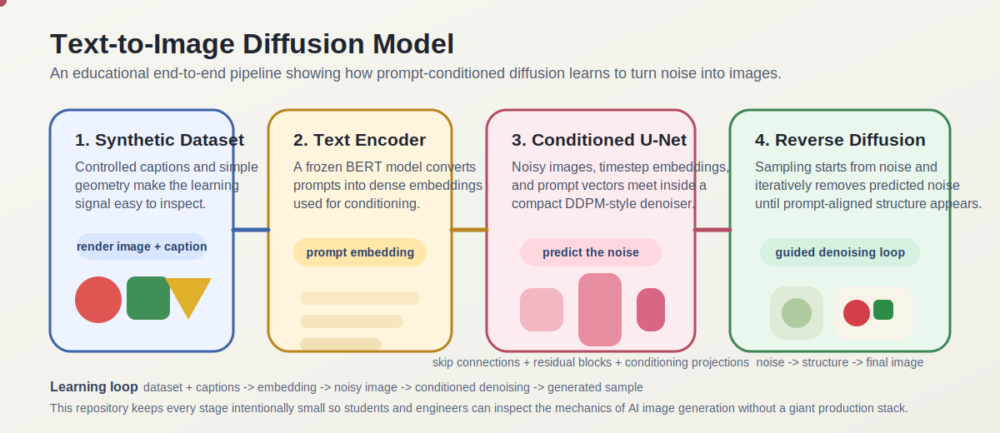
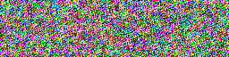
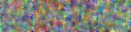
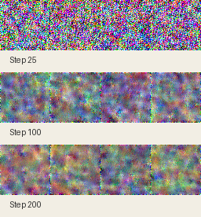
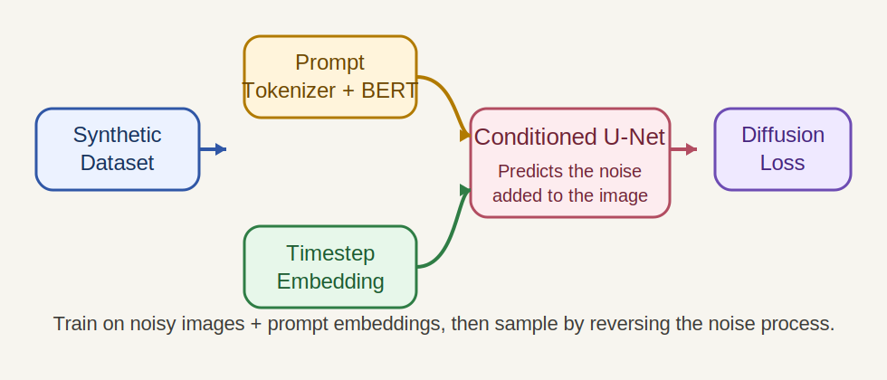
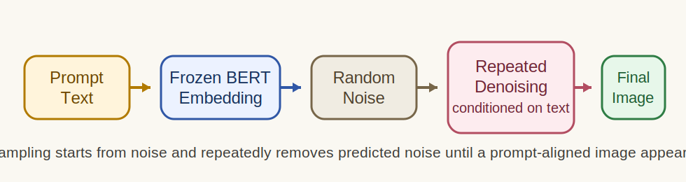

# Text-to-Image Diffusion Model

A compact text-to-image diffusion project built to answer a practical question:

**How do AI-generated images actually work under the hood?**

This repo is designed to be both:

- a portfolio project that demonstrates end-to-end ML engineering, and
- a beginner-friendly learning resource for understanding diffusion models.

It includes:

- a synthetic captioned dataset generator,
- a tiny DDPM-style U-Net in pixel space,
- a frozen pretrained text encoder for prompt conditioning,
- a minimal web app for trying checkpoints in the browser,
- training and sampling CLIs,
- tests, Docker support, and walkthrough documentation.

## Animated Project Explainer

The repo now includes an animated SVG overview of the full system:



If GitHub renders the SVG statically in the README, open [assets/project-explainer.svg](assets/project-explainer.svg) directly to view the animation in a browser.

`From scratch` in this repo means we implement the dataset generator, conditioning path, timestep embeddings, conditioned U-Net, diffusion scheduler, training loop, checkpointing, and sampling pipeline ourselves. The only pretrained component is the frozen text encoder used to convert prompts into embeddings.

## Sample Outputs

Target domain examples from the synthetic dataset:


Current generated outputs from the tiny model are still early-stage and visibly noisy, which is expected for a compact diffusion model trained on a small synthetic dataset. The value of this repo is that you can inspect exactly why those results happen and improve them step by step.

Smoke-run sample grid:



Checkpoint inference example:



Training progression from the same run:



## Why This Project Matters

Most AI image generation demos show prompts and outputs, but hide the internals. This project keeps the model intentionally small and the dataset intentionally synthetic so the moving parts stay understandable:

- how captions become embeddings,
- how noise is added during training,
- how the model learns to predict noise back out,
- how repeated denoising turns random noise into an image that matches a prompt.

If you want the conceptual walkthrough first, start here:

- [How diffusion works](docs/how-diffusion-works.md)
- [How text conditioning works](docs/how-text-conditioning-works.md)
- [How the synthetic dataset works](docs/how-the-synthetic-dataset-works.md)
- [Model architecture](docs/model-architecture.md)
- [Training walkthrough](docs/training-walkthrough.md)
- [Experiment summary](docs/experiment-summary.md)
- [How to improve this project](docs/improvement-guide.md)
- [GitHub launch checklist](docs/github-launch-checklist.md)

## Key Features

- Small enough to run locally and inspect end to end.
- Synthetic data generation keeps the task controlled and reproducible.
- Text-to-image conditioning uses a frozen `google/bert_uncased_L-2_H-128_A-2` encoder.
- Docker workflow for reproducible setup.
- Tests cover dataset determinism, model tensor shapes, and smoke-path behavior.

## How Diffusion Works in Plain English

Diffusion training teaches a model to reverse corruption.

1. Start with a clean image from the dataset.
2. Add random noise to it at a randomly chosen timestep.
3. Give the noisy image, the timestep, and the prompt embedding to the model.
4. Train the model to predict the noise that was added.
5. At inference time, start from pure noise and repeatedly denoise it.

Over many denoising steps, the random image becomes a prompt-aligned image.

## Project Architecture



Prompt-to-image sampling loop:



## Deep Learning System Architecture

This project can be understood as a layered system:

1. **Synthetic data layer**  
   Captions and images are generated together, so supervision is perfectly aligned.
2. **Text understanding layer**  
   A frozen BERT encoder converts prompts into dense embeddings.
3. **Temporal awareness layer**  
   Sinusoidal timestep embeddings tell the network how noisy the current image is.
4. **Image denoising backbone**  
   A compact conditioned U-Net predicts the noise in the current image.
5. **Diffusion process**  
   The model learns the reverse of corruption and uses iterative denoising to sample images.

## Neural Network Details

The core model is a conditioned U-Net trained with a DDPM-style epsilon prediction objective.

### Inputs to the network

- `x_t`: a noisy image at timestep `t`
- `t`: the sampled diffusion timestep
- `c`: the text conditioning vector derived from the prompt

### Internal components

- **Tokenizer + frozen BERT encoder**  
  Produces prompt embeddings from text.
- **Sinusoidal timestep embedding**  
  Encodes diffusion step information.
- **Residual U-Net blocks**  
  Process image features while mixing in time and text signals.
- **Skip connections**  
  Preserve structure across downsampling and upsampling paths.
- **Conditioning projections**  
  Inject prompt and timestep information into residual feature processing.

### Training objective

The network is trained to predict the Gaussian noise added to an image at a sampled timestep.

That means the learning target is not the final image directly. Instead, the model learns:

> how to reverse the corruption process conditioned on the prompt.

### Sampling algorithm

At inference time:

1. start from random noise,
2. repeatedly estimate noise with the U-Net,
3. update the current sample using the reverse diffusion rule,
4. use classifier-free guidance to strengthen alignment with the prompt.

### Why this algorithm matters

This is the same family of ideas used in modern diffusion-based image generation systems, just scaled down dramatically so the training loop, conditioning path, and denoising behavior are understandable.

If you want the most detailed breakdown, read:

- [Model architecture](docs/model-architecture.md)
- [How diffusion works](docs/how-diffusion-works.md)
- [How text conditioning works](docs/how-text-conditioning-works.md)

## Quickstart

### Native Python

Target runtime: Python `3.12`.

```bash
python3.12 -m venv .venv
source .venv/bin/activate
pip install --upgrade pip
pip install -r requirements.txt
```

If you only have Python `3.13`, try it first, but PyTorch compatibility may vary by environment.

### Docker

```bash
docker compose build
docker compose run --rm app python -m unittest
```

Docker is the easiest path for reproducible setup. Native Python may still be faster for local training on Apple Silicon because Docker containers typically do not expose `MPS`.

## Frontend Demo

After you have at least one trained checkpoint, you can launch the browser UI:

### Native

```bash
make web
```

Then open [http://localhost:8000](http://localhost:8000).

### Docker

```bash
make docker-web
```

## Reproducibility and Documentation Quality

This repo is prepared so future contributors, students, or recruiters can quickly understand:

- what the model is doing,
- how to run it,
- what the current outputs mean,
- how to improve it further.

That is why the project includes:

- documentation on the algorithm itself,
- experiment summaries,
- tracked visual assets,
- tests for the core pipeline,
- a browser demo layer for easier exploration.

The frontend includes:

- a prompt input,
- a checkpoint selector,
- sample prompt chips,
- run info for the selected checkpoint,
- generated image preview with saved file metadata.

## Training and Sampling Workflow

### 1. Generate a smoke dataset

```bash
python -m src.data.generate_synthetic_dataset \
  --out data/synth_smoke \
  --num-train 200 \
  --num-val 40 \
  --image-size 64 \
  --seed 42
```

### 2. Run the smoke training config

```bash
python -m src.train --config configs/text2img_smoke.yaml
```

### 3. Sample from a checkpoint

```bash
python -m src.sample \
  --checkpoint checkpoints/<run-id>/best.pt \
  --prompts "a red circle on a blue background" \
            "two green squares on a white background"
```

### 4. Scale up to the full config

```bash
python -m src.data.generate_synthetic_dataset \
  --out data/synth_v1 \
  --num-train 20000 \
  --num-val 2000 \
  --image-size 64 \
  --seed 42

python -m src.train --config configs/text2img_tiny.yaml
```

## Command Reference

If you prefer shortcuts, use the `Makefile`:

```bash
make test
make smoke-data
make smoke-train
make showcase-data
make showcase-train
make full-data
make full-train
make web
make docker-web
```

## Project Structure

```text
configs/   training configs for smoke, showcase, and full runs
docs/      learner-facing walkthroughs and experiment notes
assets/    curated media used in the GitHub README
src/       dataset generation, model code, training, and sampling
tests/     deterministic and smoke-path tests
```

## Current Results

The current public-facing results come from a curated small-scale run intended to demonstrate:

- prompt-conditioned color control,
- object count prompts,
- simple spatial relations,
- checkpoint sampling end to end.

The model is still intentionally tiny, so the right success metric is not photorealism. The goal is for samples to start reflecting the requested shape, count, color, and relation patterns while exposing the mechanics of diffusion training clearly.

## Limitations

- The image domain is synthetic rather than natural photography.
- The model is tiny and stays in pixel space, so output quality is limited.
- Prompt understanding is narrow and tied to the synthetic grammar.
- Docker training is reproducible but not the fastest option on this Mac.

## Future Improvements

- richer synthetic grammar with more compositions and layouts,
- a slightly stronger U-Net or longer training schedule,
- better experiment tracking and evaluation summaries,
- optional notebook visualizations for learners,
- eventual latent-space version for a more advanced follow-up project.

For a more detailed guide, see:

- [How to improve this project](docs/improvement-guide.md)

## Roadmap

1. Improve showcase results with a slightly longer curated run.
2. Expand docs with more visual explanations.
3. Add a notebook or interactive explanation layer.
4. Compare smoke, showcase, and full configs in a small experiment table.

## Portfolio Summary

This project demonstrates the ability to:

- build and train an end-to-end diffusion pipeline,
- make technical systems reproducible with tests and Docker,
- explain model internals clearly for other developers and learners,
- present ML work as a polished public GitHub project instead of a notebook dump.

## License

This project is released under the [MIT License](LICENSE).
